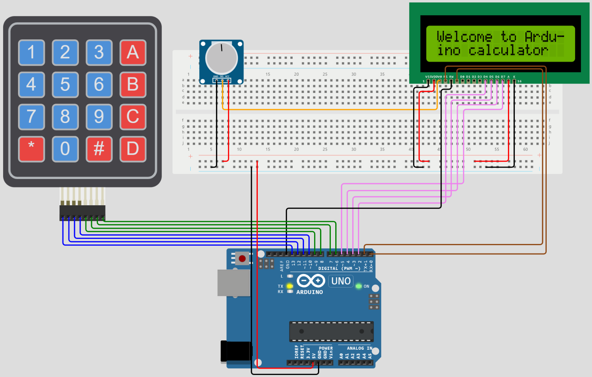

# Arduino-Calculator
Inlämningsuppgift i kursen Ellära och grundläggande programmering för inbyggda system

> Länk till projekt:  https://wokwi.com/projects/359918599245191169

## Innehållsförteckning
* **Inledning**
* **Beskrivning**
* **Användning**

### Inledning
Arduino är en elektronikplattform med lättanvänd hård-och mjukvara (öppen källkod) som gör det enkelt för vem som helst att skapa sina egna data- och elektronikprojekt. I detta projekt bygger jag en egen miniräknare med hjälp av Arduino. Den baseras på en ”4x4 membrane keypad” (knappsatsmembran) som fungerar bra för numerisk input. Tillsammans med Arduinons mikrokontroller och en liten LCD-display, kan användaren få instruktioner och se sina utförda beräkningar. Projektet genomförs i sin helhet via en onlinebaserad simulator för Arduino kallad ”Wokwi”. I syfte att underlätta projektet och dess omfattning, är miniräknarens funktionalitet begränsad så att det endast går att räkna med ensiffriga heltal på de fyra räknesätten (tex: 5+9=14, 8*8=64, 7-3=4, 6/2=3).

### Beskrivning
> Hårdvara

Miniräknaren baseras på fyra huvudsakliga hårvarukomponenter:
*   Arduino Uno (mikrokontrollerkort)
*   4x4 Keypad (knappsats för input med 4a rader och 4 kolumner)
*   LCD-display (LCD1602, skärm för output i storleken 2 rader och 16 tecken per rad)
*   Potentiometer (variabelt motstånd/resistans)



#### Keypad
Till en början kopplade jag samman keypaden med Arduino. Keypaden består av 8 olika ”pins” (kopplingsstift) varav 4 pins för att läsa keypadens rader och 4 pins för dess kolumner. Varje rad (R1-R4, blåa kablar på bild ovan) och varje kolumn (C1-C4, gröna kablar på bild ovan) kopplas direkt till endigital I/O-pin på Arduino. Jag valde digital-pin 6 till 13, men det går även att koppla till andra digitala pins på Arduinon t.ex. 9 till 2. En knapptryckning på keypaden upprättar en koppling i 
skärningspunkten mellan dess motsvarande rad och kolumn och därmed går det att avgöra vilken knapp som tryckts ner

#### LCD-display
Efter att keypaden anslutits, kopplade jag på LCD-displayen. I Wokwi’s simulator finns den i två 
varianter, I2C-varianten och standard-varianten. Jag valde den senare, kopplingen som blev enlig följande:
* VSS, RW och K till minus (jord/GND)
* VDD och A till plus (5V matningsspänning) 
* RS (command/data select) till digital-pin 0 på Arduino
* E (enable) till digital-pin 1 på Arduino
* D4, D5, D6, D7 (data transmission) till digital-pin 2, 3, 4, 5 på Arduino

#### Potentiometer
Slutligen kopplade jag en potentiometer (port SIG) till port V0 på LCD-skärmen i syfte att kunna reglera kontrasten. Det visade sig dock att Wowi-simulatorn inte hade stöd för att kunna simulera detta vilket innebar att det antagligen skulle ha räckt med en vanlig statisk resistor. Men potentiometern fick ändå ligga kvar på brädet då allt redan var kopplat och klart och fick det att fungera. Vidare kopplades GND och VCC portarna på potentiometern till Jord respektive 5V matningsspänning från Arduino.

> Mjukvara

***OBS! Här ges en sammanfattande beskrivning av programvaran. För hela den detaljerade programkoden med tillhörande kommentarer se: https://wokwi.com/projects/359918599245191169***

Kalkylatorns programvara tar sin utgångspunkt i två centrala bibliotek; `Keypad` och `LiquidCrystal`. Genom att använda dessa bibliotek går det enkelt hämta in funktionalitet för att kontrollera keypad och LCD komponenterna. Detta görs genom att instansiera objekt (`lcd` och `myKeyPad`) från klasser i LiquidCrystal resp. Keypad-biblioteken och skicka in relevant information (bl.a. pin-nummer) till resp. konstruktor. 

`LiquidCrystal lcd(0,1,2,3,4,5);`

`Keypad myKeyPad = Keypad(makeKeymap(Keys), rowPins, colPins, ROWS, COLS);`

För att avgöra vilken knapp som tryckts ner på keypaden, behöver programmet kontinuerligt scanna kaypadens rader och kolumner. Här kommer också keypad-biblioteket in i bilden som abstraherar bort denna komplexitet. En 2-dimenstionell array skapades för att representera de tecken som ska printas ut när en knapp på keypaden trycks ner. Jag valde att göra denna array identisk med keypadens knappar men detta är inget måste, dvs. det går också att representera den med andra tecken. När alla nödvändiga deklarationer (variabler, objekt, arrayer osv.) var definierade, skrevs därefter programmets logik. 
```
char Keys[ROWS][COLS] = { 
  {'1','2','3','A'},
  {'4','5','6','B'},
  {'7','8','9','C'},
  {'*','0','#','D'}
};
```
Programmet hämtar sin logik från tre funktioner: Setup, Loop och resetCalc. De två förstnämnda är två standardfunktioner, närvarande i alla Arduino-program, medan den sista är skapad för att återställa kalkylatorn. Dessa funktioner beskrivs närmare nedan.

#### Setup-funktionen
Körs en gång vid uppstart. Jag nyttjade denna funktion till att visa välkomstmeddelanden och användarinstruktioner på LCD-skärmen. De olika meddelanden visas med en viss fördröjning för att användaren ska hinna ta in informationen, exempelvis instruktioner för hantering av de fyra räknesätten på keypaden (A = +, B = -, C = *, D = /). Setup-funktionen avslutas med att meddela användaren (på LCD-skärmen) att miniräknarens funktionalitet är begränsad och endast tar ensiffriga heltal.

`void setup()`

#### Loop-funktionen
Loop-funktionen genomför själva beräkningslogiken, det är här miniräknaren hämtar sina instruktioner beroende på användarens val. Loop-funktionen består av flertalet nästlade IF-satser som utför villkorsbaserade instruktioner. Jag har dock insett att detta kan försvåra förståelsen för koden vid utomstående granskning då alla IF-satser kan göra det rörigt att hänga med i koden. I syfte att förenkla förståelsen för andra, och göra det lite ”snyggare”, hade jag kunnat dela upp loop-funktionen i separata funktioner som sedan hade anropas inne i loop-funktionen. Se till exempel Wokwi’s specade exempelprojekt med tillhörande kod för ett sådant exempel: https://wokwi.com/projects/276825819240727048.

`void loop()`

#### Reset-funktionen
Denna funktion anropas vid eventuella feltryck eller när användaren trycker på reset (*). I loop-funktionens IF-satser finns det villkorsbestämmelser för att hantera feltryck oavsett var någonstans användaren är i sitt beräknade uttryck. Till exempel om användaren trycker 9+- eller 99 så anropas reset-funktionen via IF-satserna.

`void resetCalc()`

### Användning
1. Gå in på *länk till projekt* högst upp. Detta tar dig direkt till projektet i Wokwi-simulatorn.
2. Ladda upp koden från filen `calculator.ino` i Wokwi-simulatorn om den inte redan finns där när du öppnar länken. 
3. I simulatorn, tryck på play-knappen och läs instruktionerna som dyker upp på LCD-skärmen. Använd sedan knappsatsen för att mata in dina tal och välj önskat räknesätt.
4. För att nollställa kalkylatorn, tryck på `*`.
5. För att avsluta tryck på stop-knappen.